# Upgrade Skills Icon Checklist

Source: `Assets/_Heroic/Scripts/Systems/PrototypeDraftChoices.cs`

Use each upgrade ID as the icon filename, for example:

```text
upgrade_arcane_magic_missile_split_shot.png
```

## Summary

- Total defined upgrade icon keys: 181
- Movement upgrade keys: 28
- Ability upgrade keys: 128
- System upgrade keys: 15
- System synergy upgrade keys: 10

## Movement Upgrades

### Blink

- `upgrade_movement_blink_longer_blink` - Blink: Longer Blink 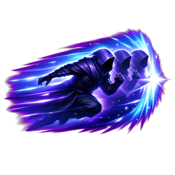
- `upgrade_movement_blink_quick_blink` - Blink: Quick Blink 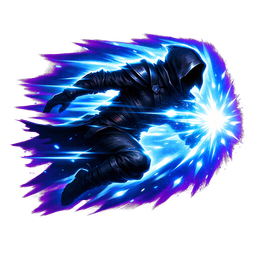
- `upgrade_movement_blink_arc_flash` - Blink: Arc Flash 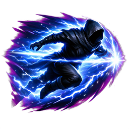

### Lunge

- `upgrade_movement_lunge_longer_lunge` - Lunge: Longer Lunge 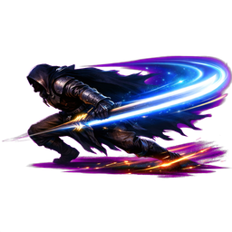
- `upgrade_movement_lunge_quick_recovery` - Lunge: Quick Recovery 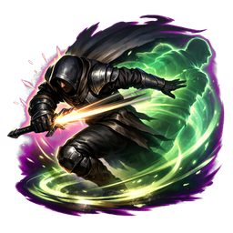
- `upgrade_movement_lunge_heavy_impact` - Lunge: Heavy Impact 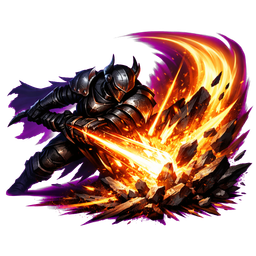

### Teleport

- `upgrade_movement_teleport_longer_teleport` - Teleport: Longer Teleport 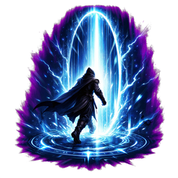
- `upgrade_movement_teleport_quick_shift` - Teleport: Quick Shift 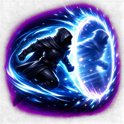
- `upgrade_movement_teleport_arrival_burst` - Teleport: Arrival Burst 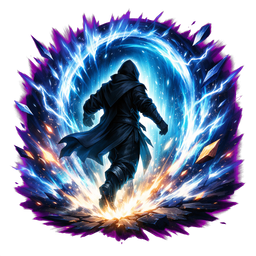

### Whirlwind

- `upgrade_movement_whirlwind_gale` - Whirlwind: Gale Engine 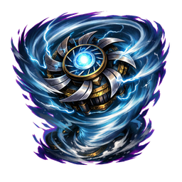
- `upgrade_movement_whirlwind_wider_spin` - Whirlwind: Wider Spin 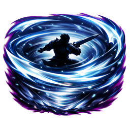
- `upgrade_movement_whirlwind_quick_spin` - Whirlwind: Quick Spin 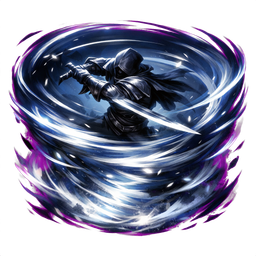

### Cloud Walk

- `upgrade_movement_cloud_walk_speed` - Cloud Walk: Faster Steps 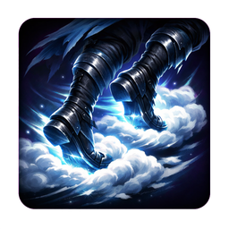
- `upgrade_movement_cloud_walk_pickup` - Cloud Walk: Cloud Reach 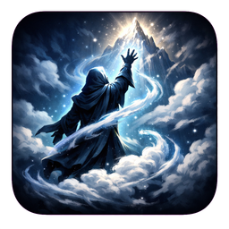
- `upgrade_movement_cloud_walk_knockback` - Cloud Walk: Rebuffing Mist 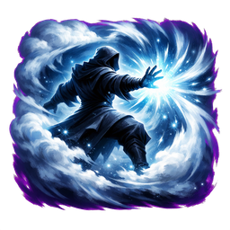

### Invisibility

- `upgrade_movement_invisibility_longer_fade` - Invisibility: Longer Fade 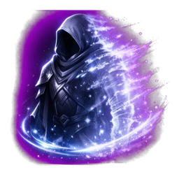
- `upgrade_movement_invisibility_swift_fade` - Invisibility: Swift Fade 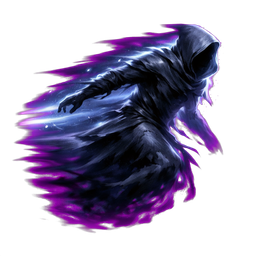
- `upgrade_movement_invisibility_exit_burst` - Invisibility: Exit Burst 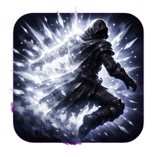

### Stoneskin

- `upgrade_movement_stoneskin_longer_skin` - Stoneskin: Longer Skin 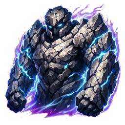
- `upgrade_movement_stoneskin_lighter_skin` - Stoneskin: Lighter Skin 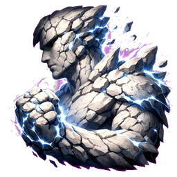
- `upgrade_movement_stoneskin_thorn_skin` - Stoneskin: Thorn Skin 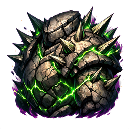

### Tunnel

- `upgrade_movement_tunnel_longer_tunnel` - Tunnel: Longer Tunnel 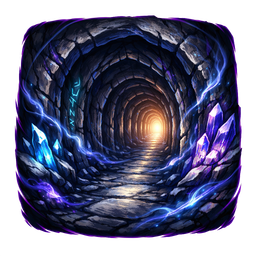
- `upgrade_movement_tunnel_deeper_tunnel` - Tunnel: Deeper Tunnel 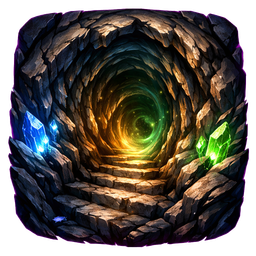
- `upgrade_movement_tunnel_eruption` - Tunnel: Eruption 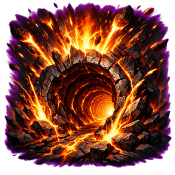

### Flight

- `upgrade_movement_flight_longer_flight` - Flight: Longer Flight 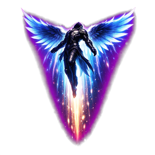
- `upgrade_movement_flight_swift_flight` - Flight: Swift Flight 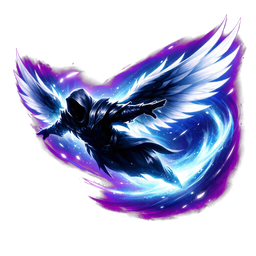
- `upgrade_movement_flight_landing_gust` - Flight: Landing Gust 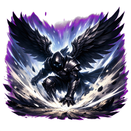

## Ability Upgrades

### Arcane

#### Magic Missile

- `upgrade_arcane_magic_missile_split_shot` - Magic Missile: Split Shot 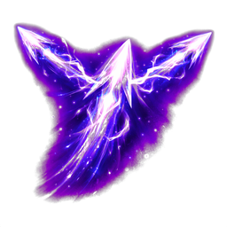
- `upgrade_arcane_magic_missile_seeking_shot` - Magic Missile: Seeking Shot 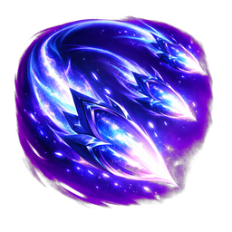
- `upgrade_arcane_magic_missile_arcane_pierce` - Magic Missile: Arcane Pierce 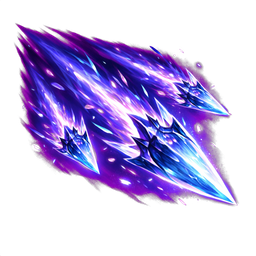

#### Arcane Blast

- `upgrade_arcane_arcane_blast_power` - Arcane Blast: Power 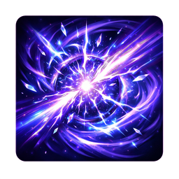
- `upgrade_arcane_arcane_blast_reach` - Arcane Blast: Reach 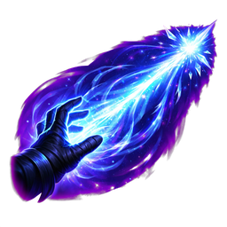
- `upgrade_arcane_arcane_blast_scatter` - Arcane Blast: Scatter 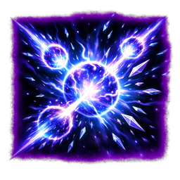

#### Warp Pulse

- `upgrade_arcane_warp_pulse_push` - Warp Pulse: Push 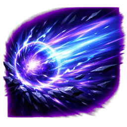
- `upgrade_arcane_warp_pulse_pull` - Warp Pulse: Pull 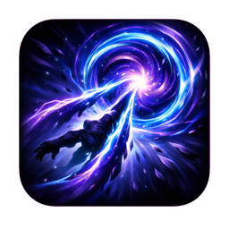
- `upgrade_arcane_warp_pulse_slow_warp` - Warp Pulse: Slow Warp 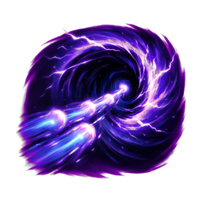

#### Spell Echo

- `upgrade_arcane_spell_echo_repeat` - Spell Echo: Repeat 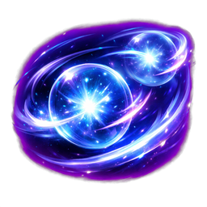
- `upgrade_arcane_spell_echo_amplify` - Spell Echo: Amplify 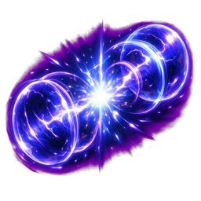
- `upgrade_arcane_spell_echo_chain_echo` - Spell Echo: Chain Echo 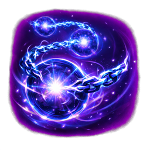

#### Arcane Orbit

- `upgrade_arcane_arcane_orbit_more_orbs` - Arcane Orbit: More Orbs 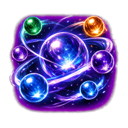
- `upgrade_arcane_arcane_orbit_faster_orbs` - Arcane Orbit: Faster Orbs 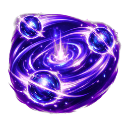
- `upgrade_arcane_arcane_orbit_larger_orbs` - Arcane Orbit: Larger Orbs 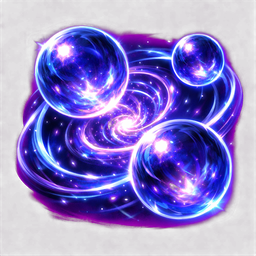

#### Force Field

- `upgrade_arcane_force_field_stronger_field` - Force Field: Stronger Field 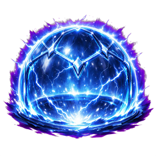
- `upgrade_arcane_force_field_wider_field` - Force Field: Wider Field 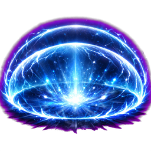
- `upgrade_arcane_force_field_quick_field` - Force Field: Quick Field 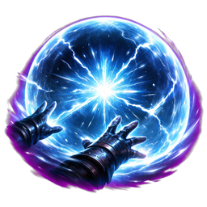

#### Time Warp

- `upgrade_arcane_time_warp_deeper_warp` - Time Warp: Deeper Warp 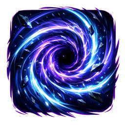
- `upgrade_arcane_time_warp_longer_warp` - Time Warp: Longer Warp 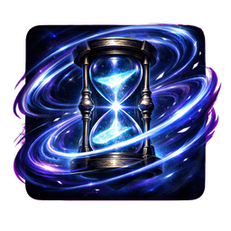
- `upgrade_arcane_time_warp_wider_warp` - Time Warp: Wider Warp 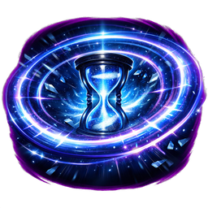

#### Haste

- `upgrade_arcane_haste_faster_haste` - Haste: Faster Haste 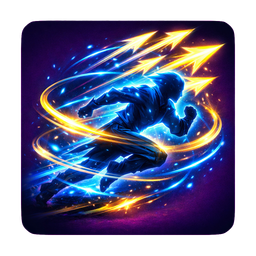
- `upgrade_arcane_haste_longer_haste` - Haste: Longer Haste 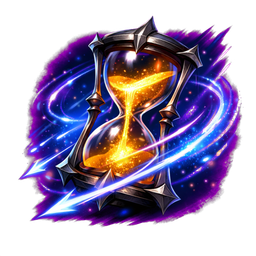
- `upgrade_arcane_haste_quick_haste` - Haste: Quick Haste 

### Fire

#### Fire Bolt

- `upgrade_fire_fire_bolt_power` - Fire Bolt: Power 
- `upgrade_fire_fire_bolt_fork` - Fire Bolt: Fork 
- `upgrade_fire_fire_bolt_pierce` - Fire Bolt: Pierce 

#### Flame Wave

- `upgrade_fire_flame_wave_heat` - Flame Wave: Heat 
- `upgrade_fire_flame_wave_reach` - Flame Wave: Reach 
- `upgrade_fire_flame_wave_width` - Flame Wave: Width 

#### Burning Ground

- `upgrade_fire_burning_ground_burn` - Burning Ground: Burn 
- `upgrade_fire_burning_ground_spread` - Burning Ground: Spread 
- `upgrade_fire_burning_ground_persist` - Burning Ground: Persist 

#### Flame Shield

- `upgrade_fire_flame_shield_hotter_shield` - Flame Shield: Hotter Shield 
- `upgrade_fire_flame_shield_wider_shield` - Flame Shield: Wider Shield 
- `upgrade_fire_flame_shield_longer_shield` - Flame Shield: Longer Shield 

#### Flame Wall

- `upgrade_fire_flame_wall_longer_wall` - Flame Wall: Longer Wall 
- `upgrade_fire_flame_wall_hotter_wall` - Flame Wall: Hotter Wall 
- `upgrade_fire_flame_wall_lingering_wall` - Flame Wall: Lingering Wall 

#### Fire Skills With No Defined Upgrades

- Fire Incinerate
- Fire Inferno
- Fire Phoenix

### Cold

#### Frost Ring

- `upgrade_cold_frost_ring_wider_ring` - Frost Ring: Wider Ring 
- `upgrade_cold_frost_ring_heavier_chill` - Frost Ring: Heavier Chill 
- `upgrade_cold_frost_ring_deep_freeze` - Frost Ring: Deep Freeze 

#### Ice Shard

- `upgrade_cold_ice_shard_more_shards` - Ice Shard: More Shards 
- `upgrade_cold_ice_shard_piercing_shards` - Ice Shard: Piercing Shards 
- `upgrade_cold_ice_shard_shatter_damage` - Ice Shard: Shatter Damage 

#### Glacial Field

- `upgrade_cold_glacial_field_wider_field` - Glacial Field: Wider Field 
- `upgrade_cold_glacial_field_longer_field` - Glacial Field: Longer Field 
- `upgrade_cold_glacial_field_deeper_chill` - Glacial Field: Deeper Chill 

#### Crystal Prison

- `upgrade_cold_crystal_prison_more_prisons` - Crystal Prison: More Prisons 
- `upgrade_cold_crystal_prison_faster_trigger` - Crystal Prison: Faster Trigger 
- `upgrade_cold_crystal_prison_hard_lock` - Crystal Prison: Hard Lock 

#### Shatter Line

- `upgrade_cold_shatter_line_wider_line` - Shatter Line: Wider Line 
- `upgrade_cold_shatter_line_longer_line` - Shatter Line: Longer Line 
- `upgrade_cold_shatter_line_brutal_shatter` - Shatter Line: Brutal Shatter 

#### Cold Skills With No Defined Upgrades

- Cold Blizzard
- Cold Frostbite
- Cold Cryostasis

### Lightning

#### Chain Bolt

- `upgrade_lightning_chain_bolt_more_jumps` - Chain Bolt: More Jumps 
- `upgrade_lightning_chain_bolt_higher_damage` - Chain Bolt: Higher Damage 
- `upgrade_lightning_chain_bolt_longer_chain` - Chain Bolt: Longer Chain 

#### Static Field

- `upgrade_lightning_static_field_bigger_field` - Static Field: Bigger Field 
- `upgrade_lightning_static_field_faster_ticks` - Static Field: Faster Ticks 
- `upgrade_lightning_static_field_stun_chance` - Static Field: Stun Chance 

#### Thunder Lance

- `upgrade_lightning_thunder_lance_piercing_lance` - Thunder Lance: Piercing Lance 
- `upgrade_lightning_thunder_lance_wider_lance` - Thunder Lance: Wider Lance 
- `upgrade_lightning_thunder_lance_critical_strike` - Thunder Lance: Critical Strike 

#### Spark Surge

- `upgrade_lightning_spark_surge_more_sparks` - Spark Surge: More Sparks 
- `upgrade_lightning_spark_surge_faster_surge` - Spark Surge: Faster Surge 
- `upgrade_lightning_spark_surge_target_spread` - Spark Surge: Target Spread 

#### Storm Call

- `upgrade_lightning_storm_call_more_strikes` - Storm Call: More Strikes 
- `upgrade_lightning_storm_call_faster_strikes` - Storm Call: Faster Strikes 
- `upgrade_lightning_storm_call_violent_storm` - Storm Call: Violent Storm 

#### Lightning Skills With No Defined Upgrades

- Lightning Ball Lightning
- Lightning Conductor
- Lightning Fork

### Earth

#### Stone Spike

- `upgrade_earth_stone_spike_more_spikes` - Stone Spike: More Spikes 
- `upgrade_earth_stone_spike_larger_spikes` - Stone Spike: Larger Spikes 
- `upgrade_earth_stone_spike_ground_breaker` - Stone Spike: Ground Breaker 

#### Boulder Toss

- `upgrade_earth_boulder_toss_bigger_boulder` - Boulder Toss: Bigger Boulder 
- `upgrade_earth_boulder_toss_more_bounce` - Boulder Toss: More Bounce 
- `upgrade_earth_boulder_toss_crushing_boulder` - Boulder Toss: Crushing Boulder 

#### Earth Wall

- `upgrade_earth_earth_wall_longer_wall` - Earth Wall: Longer Wall 
- `upgrade_earth_earth_wall_taller_wall` - Earth Wall: Taller Wall 
- `upgrade_earth_earth_wall_harden_wall` - Earth Wall: Harden Wall 

#### Quake

- `upgrade_earth_quake_larger_quake` - Quake: Larger Quake 
- `upgrade_earth_quake_stronger_quake` - Quake: Stronger Quake 
- `upgrade_earth_quake_repeated_quake` - Quake: Repeated Quake 

#### Mud Trap

- `upgrade_earth_mud_trap_bigger_trap` - Mud Trap: Bigger Trap 
- `upgrade_earth_mud_trap_stickier_mud` - Mud Trap: Stickier Mud 
- `upgrade_earth_mud_trap_heavy_mud` - Mud Trap: Heavy Mud 

#### Earth Skills With No Defined Upgrades

- Earth Quicksand
- Earth Brambles
- Earth Swarm

### Mind

#### Psychic Lance

- `upgrade_mind_psychic_lance_more_damage` - Psychic Lance: More Damage 
- `upgrade_mind_psychic_lance_longer_range` - Psychic Lance: Longer Range 
- `upgrade_mind_psychic_lance_mind_pierce` - Psychic Lance: Mind Pierce 

#### Fear Wave

- `upgrade_mind_fear_wave_bigger_wave` - Fear Wave: Bigger Wave 
- `upgrade_mind_fear_wave_longer_fear` - Fear Wave: Longer Fear 
- `upgrade_mind_fear_wave_stronger_panic` - Fear Wave: Stronger Panic 

#### Illusion Clone

- `upgrade_mind_illusion_clone_more_clones` - Illusion Clone: More Clones 
- `upgrade_mind_illusion_clone_stronger_decoys` - Illusion Clone: Stronger Decoys 
- `upgrade_mind_illusion_clone_clone_burst` - Illusion Clone: Clone Burst 

#### Confuse

- `upgrade_mind_confuse_wider_effect` - Confuse: Wider Effect 
- `upgrade_mind_confuse_longer_confusion` - Confuse: Longer Confusion 
- `upgrade_mind_confuse_deeper_confusion` - Confuse: Deeper Confusion 

#### Mind Crush

- `upgrade_mind_mind_crush_more_damage` - Mind Crush: More Damage 
- `upgrade_mind_mind_crush_area_crush` - Mind Crush: Area Crush 
- `upgrade_mind_mind_crush_execution_crush` - Mind Crush: Execution Crush 

#### Mind Skills With No Defined Upgrades

- Mind Telekinesis
- Mind Push
- Mind Mass Charm

### Blood

#### Blood Bolt

- `upgrade_blood_blood_bolt_more_damage` - Blood Bolt: More Damage 
- `upgrade_blood_blood_bolt_lifesteal` - Blood Bolt: Lifesteal 
- `upgrade_blood_blood_bolt_splash_drain` - Blood Bolt: Splash Drain 

#### Sanguine Pact

- `upgrade_blood_sanguine_pact_more_power` - Sanguine Pact: More Power 
- `upgrade_blood_sanguine_pact_more_healing` - Sanguine Pact: More Healing 
- `upgrade_blood_sanguine_pact_lower_cost` - Sanguine Pact: Lower Cost 

#### Blood Nova

- `upgrade_blood_blood_nova_bigger_nova` - Blood Nova: Bigger Nova 
- `upgrade_blood_blood_nova_stronger_nova` - Blood Nova: Stronger Nova 
- `upgrade_blood_blood_nova_healing_nova` - Blood Nova: Healing Nova 

#### Leech Bind

- `upgrade_blood_leech_bind_longer_bind` - Leech Bind: Longer Bind 
- `upgrade_blood_leech_bind_stronger_drain` - Leech Bind: Stronger Drain 
- `upgrade_blood_leech_bind_multi_bind` - Leech Bind: Multi-Bind 

#### Crimson Frenzy

- `upgrade_blood_crimson_frenzy_faster_attacks` - Crimson Frenzy: Faster Attacks 
- `upgrade_blood_crimson_frenzy_more_damage` - Crimson Frenzy: More Damage 
- `upgrade_blood_crimson_frenzy_low_health_power` - Crimson Frenzy: Low Health Power 

#### Blood Skills With No Defined Upgrades

- Blood Drain Life
- Blood Blood Boil
- Blood Exsanguinate

### Poison

#### Poison Dart

- `upgrade_poison_poison_dart_more_darts` - Poison Dart: More Darts 
- `upgrade_poison_poison_dart_stronger_poison` - Poison Dart: Stronger Poison 
- `upgrade_poison_poison_dart_spread_poison` - Poison Dart: Spread Poison 

#### Toxic Cloud

- `upgrade_poison_toxic_cloud_bigger_cloud` - Toxic Cloud: Bigger Cloud 
- `upgrade_poison_toxic_cloud_longer_cloud` - Toxic Cloud: Longer Cloud 
- `upgrade_poison_toxic_cloud_heavier_cloud` - Toxic Cloud: Heavier Cloud 

#### Venom Trail

- `upgrade_poison_venom_trail_longer_trail` - Venom Trail: Longer Trail 
- `upgrade_poison_venom_trail_stronger_trail` - Venom Trail: Stronger Trail 
- `upgrade_poison_venom_trail_sticky_trail` - Venom Trail: Sticky Trail 

#### Infection

- `upgrade_poison_infection_faster_spread` - Infection: Faster Spread 
- `upgrade_poison_infection_stronger_infection` - Infection: Stronger Infection 
- `upgrade_poison_infection_collapse` - Infection: Collapse 

#### Rot Bloom

- `upgrade_poison_rot_bloom_bigger_bloom` - Rot Bloom: Bigger Bloom 
- `upgrade_poison_rot_bloom_more_bloom_damage` - Rot Bloom: More Bloom Damage 
- `upgrade_poison_rot_bloom_lingering_rot` - Rot Bloom: Lingering Rot 

#### Poison Skills With No Defined Upgrades

- Poison Disintegrate
- Poison Poison Cloud
- Poison Disease

## System Upgrades

### Territory Casting

- `upgrade_system_territory_casting_more_territories` - Territory Casting: More Territories 
- `upgrade_system_territory_casting_larger_territories` - Territory Casting: Larger Territories 
- `upgrade_system_territory_casting_stronger_territories` - Territory Casting: Stronger Territories 

### Component Magic

- `upgrade_system_component_boosts_potent_components` - Component Boosts: Potent Components 
- `upgrade_system_component_boosts_extended_components` - Component Boosts: Extended Components 
- `upgrade_system_component_boosts_efficient_components` - Component Boosts: Efficient Components 

### Sacrificial Casting

- `upgrade_system_sacrifice_casting_deeper_sacrifice` - Sacrifice Casting: Deeper Sacrifice 
- `upgrade_system_sacrifice_casting_quick_offering` - Sacrifice Casting: Quick Offering 
- `upgrade_system_sacrifice_casting_controlled_cost` - Sacrifice Casting: Controlled Cost 

### Rhythm Casting

- `upgrade_system_rhythm_casting_steady_rhythm` - Rhythm Casting: Steady Rhythm 
- `upgrade_system_rhythm_casting_perfect_beat` - Rhythm Casting: Perfect Beat 
- `upgrade_system_rhythm_casting_clean_timing` - Rhythm Casting: Clean Timing 

### Spell Tension

- `upgrade_system_spell_tension_charged_incantations` - Spell Tension: Charged Incantations 
- `upgrade_system_spell_tension_longer_chants` - Spell Tension: Longer Chants 
- `upgrade_system_spell_tension_debt_control` - Spell Tension: Debt Control 

### Systems With No Defined Upgrades

- Echo Casting
- Spell Weaving
- Runic Magic

## System Synergy Upgrades

- `upgrade_system_synergy_territory_components` - Territory + Components 
- `upgrade_system_synergy_territory_sacrifice` - Territory + Sacrifice 
- `upgrade_system_synergy_territory_rhythm` - Territory + Rhythm 
- `upgrade_system_synergy_territory_tension` - Territory + Tension 
- `upgrade_system_synergy_components_sacrifice` - Components + Sacrifice 
- `upgrade_system_synergy_components_rhythm` - Components + Rhythm 
- `upgrade_system_synergy_components_tension` - Components + Tension 
- `upgrade_system_synergy_sacrifice_rhythm` - Sacrifice + Rhythm 
- `upgrade_system_synergy_sacrifice_tension` - Sacrifice + Tension 
- `upgrade_system_synergy_rhythm_tension` - Rhythm + Tension 
