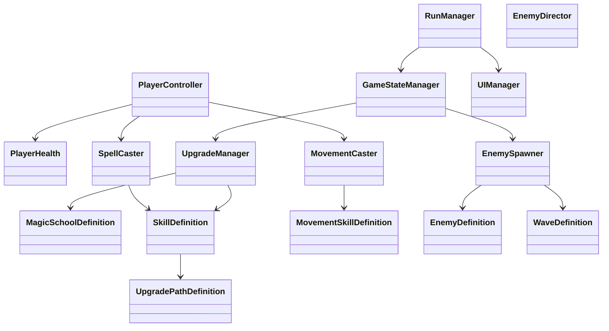

# Heroic Unity Architecture

## Goal

Build Heroic as a data-driven 2D bullet heaven in Unity using C#.

The core design goals are:

- living spellbook progression
- 8 magic schools
- strategic movement skills
- enemy swarms and boss pressure
- simple scene flow and strong replayability

## Scene Layout

### 1. `MainMenu`

Use for:

- start run
- settings
- quit

### 2. `Game`

Use for:

- the active run
- arena gameplay
- UI overlays
- upgrade drafts
- enemy spawning

### 3. `Results`

Use for:

- run summary
- score/stats
- restart

## Folder Layout

```text
Assets/_Heroic/
  Art/
  Audio/
  Prefabs/
  Scenes/
  Scripts/
    Core/
    Combat/
    Data/
    Enemies/
    Player/
    Spells/
    Systems/
    UI/
    Utilities/
  ScriptableObjects/
    Schools/
    Skills/
    Movement/
    Upgrades/
    Enemies/
    Waves/
  UI/
```

## Core Runtime Classes

### `RunManager`

Owns the run lifecycle.

- starts and ends runs
- tracks score and run state
- handles transitions between menu, game, and results

### `GameStateManager`

Controls current gameplay state.

- playing
- paused
- level-up draft
- results

### `PlayerController`

Handles player movement and input.

- movement vector
- collision / steering
- movement skill activation
- interaction with combat state

### `PlayerHealth`

Handles player health and death.

- current HP
- max HP
- damage
- healing
- death event

### `SpellCaster`

Executes spell logic for the player.

- casts attack abilities
- handles cast timing
- applies school modifiers
- triggers proc effects

### `MovementCaster`

Executes movement skill logic.

- movement ability activation
- cooldowns
- slot mapping 1, 2, 3
- movement-specific effects

### `UpgradeManager`

Owns the level-up draft system.

- creates choices
- filters by category
- applies selected upgrades
- updates the living spellbook

### `EnemySpawner`

Creates enemy waves and spawn pressure.

- spawn patterns
- wave pacing
- elite/boss spawning

### `EnemyDirector`

Coordinates enemy behavior during the run.

- swarm pressure
- difficulty ramp
- special encounter triggers

### `UIManager`

Handles run UI and level-up UI.

- health
- XP
- level
- movement slots
- upgrade choices

## Combat Layer Classes

### `Damageable`

Shared component for anything that can take damage.

### `Hitbox`

Represents damage application zones.

### `Projectile`

Used for missile-style and bolt-style attacks.

### `AreaEffect`

Used for zones, walls, ground effects, and pulses.

### `StatusEffect`

Used for:

- burn
- slow
- freeze
- stun
- bleed
- drain
- fear
- confuse
- contagious poison

## Data Layer ScriptableObjects

### `MagicSchoolDefinition`

Holds school identity and skill references.

### `SkillDefinition`

Holds:

- skill name
- role
- base behavior
- upgrade paths

### `UpgradePathDefinition`

Holds a single branching upgrade path for a skill.

### `MovementSkillDefinition`

Holds movement skill data.

### `EnemyDefinition`

Holds enemy stats and behavior tags.

### `WaveDefinition`

Holds spawn timing and enemy composition.

## Class Diagram



## Recommended Implementation Order

### Phase 1

- project setup
- scene setup
- player movement
- camera follow
- basic enemy spawn

### Phase 2

- basic attack spell
- health and damage
- XP and leveling
- level-up draft UI

### Phase 3

- first movement skill
- first school tree
- status effects
- wave pressure

### Phase 4

- full school data
- all movement skills
- all upgrade paths
- enemy variety and bosses

## Design Rule

Keep logic data-driven.

If a skill changes, it should usually change in its data asset first, not in the code structure itself.
